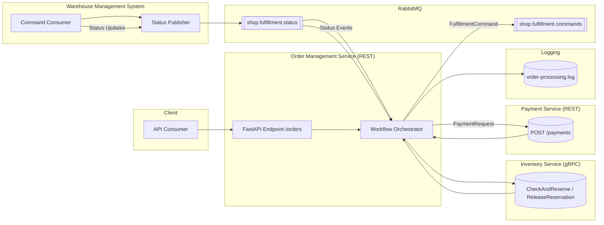

## Architekturübersicht

## Ablaufbeschreibung

1. Ein Client sendet eine Bestellung via `POST /orders` an das OMS.
2. Der Orchestrator validiert die Bestellung, protokolliert den Eingang und ruft das Inventory Service via gRPC (`CheckAndReserve`) auf.
3. Fällt die Reservierung positiv aus, wird der Payment Service via `POST /payments` aufgerufen.
4. Nach erfolgreicher Zahlung sendet der Orchestrator einen `OrderFulfillmentCommand` auf die RabbitMQ-Queue `shop.fulfillment.commands`.
5. Ein WMS-Worker simuliert die Lagerprozesse und publiziert Statusereignisse (`FulfillmentStatusEvent`) auf `shop.fulfillment.status`.
6. Der Orchestrator empfängt diese Ereignisse, aktualisiert den Auftragsstatus und schreibt jeden Schritt ins Log.
7. Bei Fehlschlägen werden Reservierungen freigegeben, Zahlungen ggf. storniert und der Auftrag im OMS als fehlgeschlagen markiert.

## Fehlerszenarien & Behebungsstrategien

| System | Fehlerszenario | Auswirkung | Gegenmaßnahmen |
|--------|----------------|------------|----------------|
| OMS | Eingabedaten ungültig | Auftrag wird nicht gestartet | Request validieren, `400 Bad Request` zurückgeben |
| Inventory Service | Artikel teilweise oder nicht verfügbar | Auftrag kann nicht erfüllt werden | Auftrag auf `INVENTORY_UNAVAILABLE` setzen, Kunde informieren, ggf. Alternativen anbieten |
| Inventory Service | gRPC-Timesout / Netzwerkfehler | Unbekannter Status der Reservierung | Retry mit exponentiellem Backoff (idempotente Requests), Fallback auf asynchrone Bearbeitung, Operator benachrichtigen |
| Payment Service | Zahlung abgelehnt (402) | Auftrag bleibt unbezahlt | Reservierung freigeben, Auftrag stornieren, Kunde informieren |
| Payment Service | Service nicht erreichbar / 5xx | Zahlungsergebnis unbekannt | Retry-Strategie, Circuit Breaker, manuelle Nachbearbeitung falls notwendig |
| RabbitMQ | Broker nicht erreichbar | Fulfillment kann nicht angestoßen werden | Auftrag auf `FAILED` setzen, Operator alarmieren, nach Wiederherstellung erneut versuchen |
| WMS | Command nicht verarbeitet | Keine Lagerprozesse gestartet | Dead-Letter-Queue nutzen, Monitoring, erneuter Versand möglich |
| WMS | Status-Events fehlen oder doppelt | Fortschrittsanzeige inkonsistent | Ereignisse idempotent verarbeiten (Status >= aktueller Status ignorieren), Timeout zur Fehlererkennung |
| Logging | Datei nicht schreibbar | Nachvollziehbarkeit leidet | Fallback auf STDOUT oder zentrales Logging, Health-Check |

Weitere technische Maßnahmen:

- Idempotente Auftragsverarbeitung (Order-ID als Korrelationsschlüssel)
- Korrelations-IDs zur Nachverfolgung in Log und Messages
- Konfigurierbare Retry-Anzahl pro Service (Inventory/Payment/RabbitMQ)
- Überwachung der Message-Queues und automatisierte Alerts
- Testszenarien für positive Flows, Inventar-Fehler und Payment-Fehler

